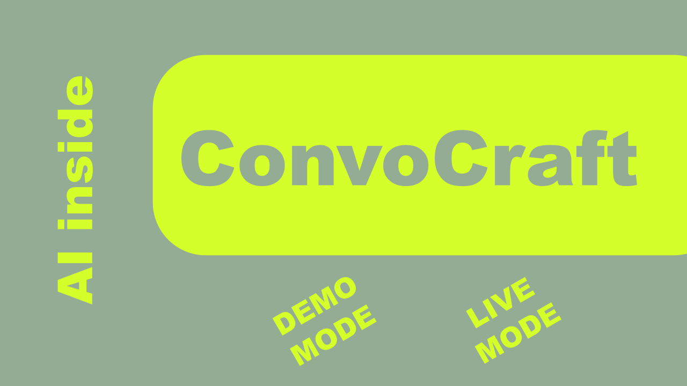

# ConvoCraft 🗣️✨

> Master tough talks with ConvoCraft. Practice any scenario with an AI persona, get instant feedback, and build the confidence to win any conversation. Your personal dialogue gym.

<!-- You can replace this URL with a more updated screenshot or GIF -->

---

## Table of Contents

- [About The Project](#about-the-project)
- [Key Features](#key-features)
- [Built With](#built-with)
- [Getting Started](#getting-started)
  - [Prerequisites](#prerequisites)
  - [Installation](#installation)
- [Usage](#usage)
  - [Guided Tour](#guided-tour)
  - [Interactive Mode](#interactive-mode)
- [Technical Highlights](#technical-highlights)
  - [Performance-First Design](#performance-first-design)
  - [Hybrid AI Model](#hybrid-ai-model)
- [License](#license)
- [Attribution](#attribution)

---

## About The Project

**ConvoCraft** is a "flight simulator" for difficult conversations. It's a single-page web application designed to help you practice and improve your communication skills in a safe, repeatable, and AI-powered environment. Whether you're preparing to ask for a raise, deliver constructive feedback, or navigate a sensitive personal topic, ConvoCraft provides a space to rehearse, experiment, and build confidence.

The entire application runs directly in your browser, with no backend, no installation, and a strong focus on privacy and performance.

---

## Key Features

- **Dynamic AI Personas:** Configure an AI counterpart with a specific goal and personality style for a realistic role-playing experience.
- **Full AI Simulation:** Powered by the **Google Gemini API** for nuanced, context-aware dialogue that feels lifelike.
- **Offline Functionality:** Generate scenarios and paraphrase text using a **built-in, browser-based LLM**—no internet connection or API key required.
- **Instant Performance Feedback:** Get a detailed analysis of your conversational strategy, highlighting strengths and areas for improvement.
- **Observation Mode:** Let the AI take your role to see an example of how a conversation could be handled.
- **Zero Installation:** Runs entirely from a single `index.html` file in any modern web browser.
- **Highly Performant:** Optimized to run smoothly on devices with as little as 4GB of RAM.

---

## Built With

ConvoCraft is built with a minimalist and performance-oriented tech stack:

-   **Vanilla JavaScript (ES6+ Modules):** No frameworks, no bloat. Just pure, efficient code.
-   **HTML5 & CSS3:** For a clean, modern, and responsive user interface.
-   **Google Gemini API:** The core engine for high-fidelity AI interactions.
-   **Transformers.js (@xenova/transformers):** For running a lightweight LLM (`Xenova/flan-t5-small`) directly in the browser.
-   **Web Speech API:** For immersive text-to-speech voice generation.

---

## Getting Started

Getting started with ConvoCraft is as simple as possible.

### Prerequisites

-   A modern web browser (Chrome, Firefox, Edge, Safari).
-   (Optional) A Google Gemini API key to unlock the full AI simulation and feedback features. You can get one from [Google AI Studio](https://aistudio.google.com/app/apikey).

### Installation

1.  Download the `index.html` file from this repository.
2.  Open the `index.html` file directly in your web browser. That's it!
3.  (Optional) To enable full features:
    -   Click on the **"Configure Scenario"** button.
    -   Go to the **"Setup"** tab.
    -   Paste your Google Gemini API key into the designated field. Your key is saved locally in your browser's `localStorage` and is never sent anywhere else.

---

## Usage

### Guided Tour

For first-time users, the best way to start is with the **Guided Tour**. Simply click the "Start Guided Tour" button on the main screen to get a narrated walkthrough of all the key features.

### Interactive Mode

1.  **Configure Scenario:**
    -   Click **"Configure Scenario"** to open the side panel.
    -   In the **"Persona Profile"** tab, define your AI counterpart's goal and personality. Click "Generate Persona Profile" to create a detailed backstory.
    -   In the **"Scenario Context"** tab, choose a preset or describe the setting for your conversation.
2.  **Start Dialogue:**
    -   Close the panel and click the **"Start Dialogue"** button.
    -   The AI persona will begin the conversation. Type your response in the input field and press `Enter` or click "Send".
3.  **Request Feedback:**
    -   Once you feel the conversation is complete, click the **"Request Feedback"** button.
    -   The AI will provide a detailed report on your performance, which will appear at the bottom of the chat window.

---

## Technical Highlights

### Performance-First Design

ConvoCraft was engineered from the ground up to be lightweight and accessible. Key optimizations include:

-   **No Frameworks:** By avoiding heavy frameworks, we keep the memory footprint to an absolute minimum.
-   **Dynamic Model Loading:** The in-browser LLM (via Transformers.js) is only loaded into memory on its first use, not on initial page load. This saves hundreds of megabytes of RAM for users who may not need the feature.

### Hybrid AI Model

The application leverages a powerful hybrid AI strategy:

1.  **Remote AI (Gemini):** Used for complex, creative tasks like dialogue generation and nuanced analysis, providing state-of-the-art quality.
2.  **Local AI (Transformers.js):** Used for fast, private, and offline-capable utility tasks like paraphrasing text, ensuring the app remains useful even without an API key.

---

## License

Distributed under the MIT License.

---

## Attribution

This project was conceived and developed by **SMZ**. 
